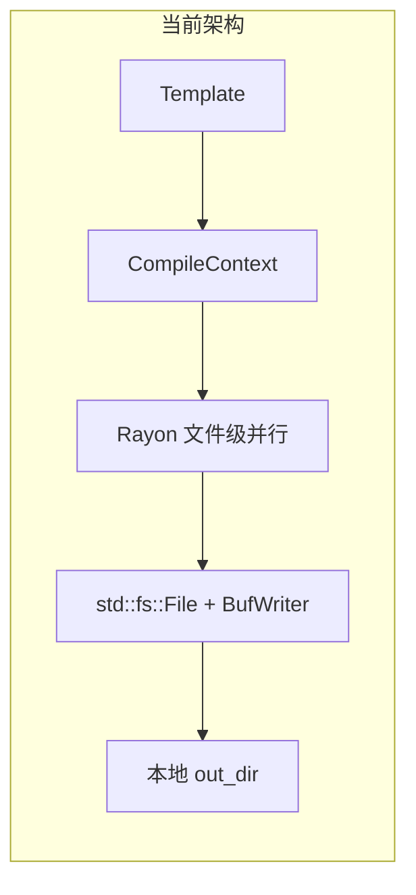
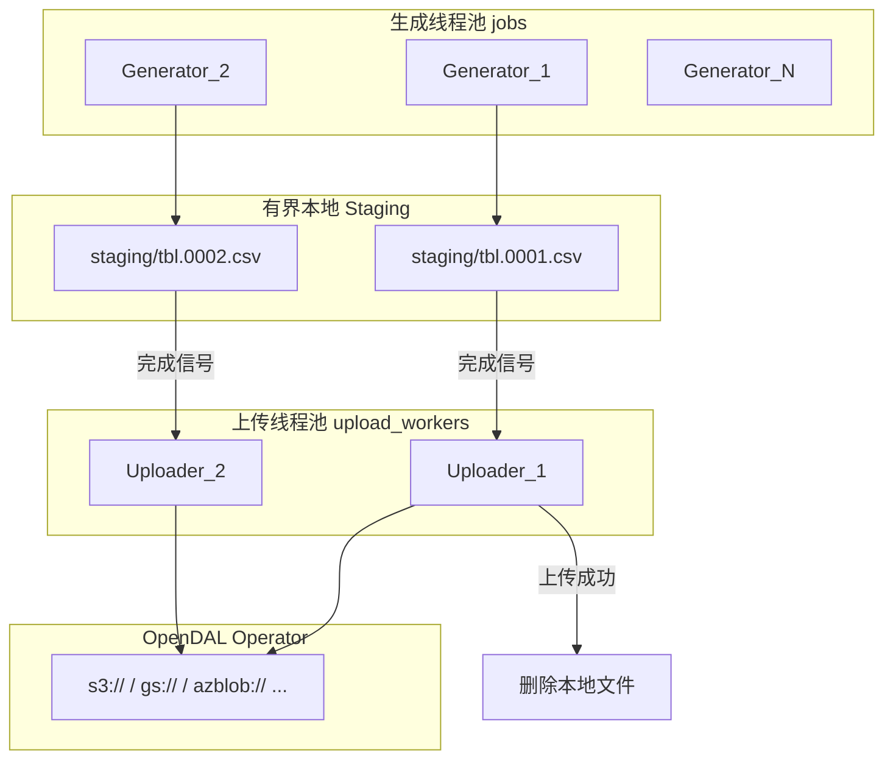
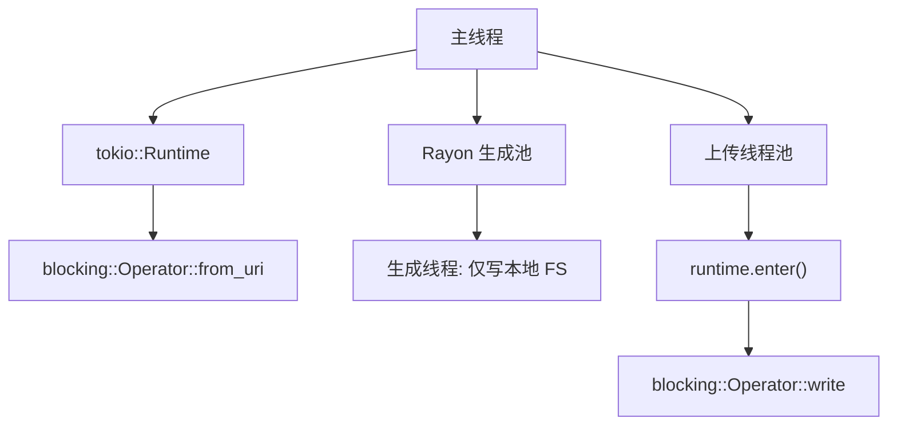
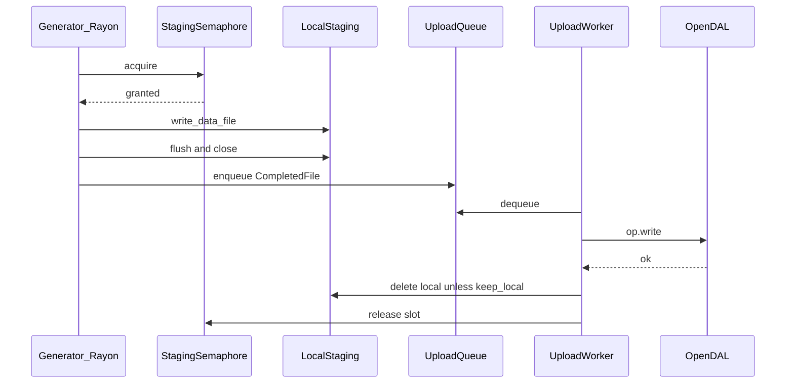

dbgen 对象存储流水线上传
=========================

本文档描述 dbgen 在 TB 级数据生成场景下，通过**有界本地 staging** 与**生成/上传流水线**，将输出文件写入 OpenDAL 支持的对象存储（`s3://`、`gs://`、`azblob://` 等）的设计方案。

相关文档：

* [Table generator `dbgen`](CLI.md) — 现有 CLI 参数与输出格式
* [`dbdbgen` reference](Dbdbgen.md) — 多表编排与 Jsonnet 配置

---

## 1. 概述与动机

### 1.1 问题背景

dbgen 当前将所有生成结果直接写入本地文件系统。在 [`src/cli.rs`](src/cli.rs) 中，Rayon 线程池并行调用 `write_data_file`，最终通过 `std::fs::File` + `BufWriter` 落盘：

```
{out_dir}/{unique_table}.{file_index}[.{compression}]
```

对于 TB 级测试数据：

* 本地磁盘往往无法容纳全量输出；
* 大规模数据导入（TiDB Lightning、COPY FROM S3、外部表等）通常从对象存储读取；
* 需要在**本地仅保留少量 staging 文件**的同时，持续将已完成文件上传至远程存储。

### 1.2 设计目标

| 目标 | 说明 |
|------|------|
| 有界本地磁盘占用 | 通过 staging 槽位/大小上限，控制本地同时存在的文件数量 |
| 生成与上传并行 | 生成线程与上传线程解耦，流水线作业 |
| 统一对象存储接口 | 使用 [Apache OpenDAL](https://opendal.apache.org/)，支持多种 URI scheme |
| 最小侵入现有代码 | 保留 `FormatWriter` / 压缩 / `-z` 切分逻辑 |
| 可选编译 | 通过 Cargo feature `object-storage` 引入，默认不增加依赖 |

### 1.3 非目标（本期不做）

* 从对象存储**读取**模板（仅上传输出）
* 分布式多机生成协调
* 预签名 URL / 客户端直传

---

## 2. 使用场景与约束

### 2.1 典型场景

```sh
# 生成 1 亿行 CSV，本地 staging 最多 8 个文件，上传至 S3
dbgen -i template.sql \
  -o ./out \
  --remote-uri s3://my-bucket/tpcc/data \
  --staging-dir /tmp/dbgen-staging \
  -N 100M -R 1M -r 1000 \
  -j 8 --upload-workers 4
```

生成过程中：

1. 8 个 Rayon 线程并行写本地 staging 目录；
2. 文件写完后进入上传队列，由 4 个上传线程通过 OpenDAL 写入 S3；
3. 上传成功后删除本地 staging 文件，释放磁盘槽位；
4. 全部数据最终位于 `s3://my-bucket/tpcc/data/`，本地仅短暂持有少量文件。

### 2.2 约束与假设

* 每个逻辑输出文件（含 `-z` 切分出的子文件）作为独立 object 上传；
* 上传为**覆盖写**（相同 key 重复运行会覆盖），生产环境建议使用带 run-id 的 prefix；
* 进程被 SIGINT 中断时，staging 目录可能残留未上传文件，需人工补传（MVP 不做 checkpoint）；
* OpenDAL `blocking::Operator` 依赖 tokio runtime，需与 Rayon 生成池隔离。

---

## 3. 架构设计

### 3.1 当前架构



关键代码锚点：

* 并行调度：[`src/cli.rs`](src/cli.rs) `ThreadPoolBuilder` + `into_par_iter().try_for_each`（约 L447–562）
* 文件写入：[`Env::write_data_file`](src/cli.rs)（约 L1049–1085）通过 `open_data_file` → `File::create`
* 行写入编排：[`src/writer.rs`](src/writer.rs) `writer::Env`

### 3.2 目标架构



### 3.3 设计原则

| 原则 | 说明 |
|------|------|
| 有界 staging | 本地同时存在的**生成中 + 待上传**文件数或总字节数有上限；达上限时生成线程阻塞 |
| 生成优先写本地 | 最小化对 `FormatWriter` / `writer::Env` 的侵入；压缩、`-z` 切分逻辑保持不变 |
| 上传用 OpenDAL URI | 通过 `--remote-uri` 配置 `s3://bucket/prefix`、`gs://...`、`azblob://...`；凭证走 OpenDAL 标准环境变量 |
| 上传后删除 | 默认删除 staging 中已成功上传的文件；`--keep-local` 保留副本 |
| Schema 小文件直传 | `*-schema.sql` / `*-schema-create.sql` 体积极小，生成后直接 `op.write`，不经 staging 队列 |

### 3.4 为何采用「staging + 上传」而非直写对象存储

1. **与现有 `Write` 抽象兼容**：`FormatWriter` 实现 `std::io::Write`，压缩层（gzip/xz/zstd）和 `BufWriter` 无需重写。
2. **文件完整性**：每个逻辑文件（含 `-z` 切分出的子文件）作为独立 object 上传，边界清晰。
3. **失败恢复**：上传失败时本地 staging 文件仍在，可重试。
4. **OpenDAL 约束**：`blocking::Writer` 需在持有它的线程内 `close()` 才完成 multipart；staging 模式将「生成完成」与「上传开始」解耦，便于独立调节 `jobs` 与 `upload_workers`。

---

## 4. CLI 参考

以下参数通过 Cargo feature `object-storage` 启用，添加到 [`Args`](src/cli.rs) 结构体。

### 4.1 新增参数

| 参数 | 类型 | 默认值 | 说明 |
|------|------|--------|------|
| `--remote-uri` | URI 字符串 | — | 启用远程输出时**必填**。如 `s3://my-bucket/tpcc/data` |
| `--staging-dir` | 目录路径 | `{out_dir}/.staging` | 本地 staging 目录 |
| `--max-staging-files` | 正整数 | `min(jobs, 8)` | 本地最多同时存在的 staging 文件数 |
| `--max-staging-size` | 大小 | — | 可选。staging 目录总字节上限（与 files 可同时生效，先触达者阻塞） |
| `--upload-workers` | 正整数 | `4` | 上传线程数 |
| `--keep-local` | flag | `false` | 上传成功后不删除 staging 文件 |
| `--remote-prefix` | 路径 | — | 可选。追加到 object key 的前缀（在 URI path 之后） |
| `--fail-fast` | flag | `false` | 任一上传失败时立即中止全局任务 |

### 4.2 `out_dir` 语义

* **未指定 `--remote-uri`**：行为与现有一致，所有文件写入 `out_dir`。
* **指定 `--remote-uri`**：
  * 数据文件写入 `staging_dir`，上传至远程后删除（除非 `--keep-local`）；
  * schema 文件可同时写本地 `out_dir` 并直传远程；
  * 远程 object key = `{uri_path_prefix}/{remote_prefix}/{relative_path}`，`relative_path` 与当前本地命名一致（如 `tbl.0001.csv.gz`）。

### 4.3 使用示例

```sh
# AWS S3
dbgen -i template.sql -o ./out \
  --remote-uri s3://test-bucket/benchmark/data \
  -N 10M -R 500K -r 100 -j 4 --upload-workers 2

# Google Cloud Storage
dbgen -i template.sql -o ./out \
  --remote-uri gs://my-bucket/tpcc/ \
  -N 1M -R 100K -f csv -c gzip

# Azure Blob
dbgen -i template.sql -o ./out \
  --remote-uri azblob://container/path \
  -N 1M -R 100K

# 保留本地副本、限制 staging 为 4 个文件
dbgen -i template.sql -o ./out \
  --remote-uri s3://bucket/data \
  --max-staging-files 4 \
  --keep-local \
  -j 16 --upload-workers 8
```

### 4.4 dbdbgen 集成

`Args` 已实现 `Serialize` / `Deserialize`，新字段可直接在 Jsonnet `steps` 中使用：

```jsonnet
local dbdbgen = import 'dbdbgen.libsonnet';

{
  steps(m): [
    m {
      template_string: |||
        CREATE TABLE item (i_id INT PRIMARY KEY, i_name VARCHAR(24));
        item.i_id = @row_num;
        item.i_name = rand.regex('[A-Z]{24}');
      |||,
      out_dir: 'item/',
      remote_uri: 's3://my-bucket/tpcc/' + m.out_subdir,
      total_count: m.warehouses * 100000,
      rows_per_file: 100000,
      rows_count: 1000,
      jobs: 4,
      upload_workers: 2,
    },
  ],
  // ...
}
```

详见 [`Dbdbgen.md`](Dbdbgen.md)。

---

## 5. OpenDAL URI 与认证配置

### 5.1 支持的 URI scheme

通过 OpenDAL `Operator::from_uri` 解析，首期启用以下 backend feature：

| URI scheme | 示例 | 说明 |
|------------|------|------|
| `s3://` | `s3://bucket/prefix` | AWS S3 及兼容服务（MinIO、腾讯云 COS 等） |
| `gs://` | `gs://bucket/prefix` | Google Cloud Storage |
| `azblob://` | `azblob://container/path` | Azure Blob Storage |

后续可按需扩展 `oss://`、`cos://` 等 OpenDAL 支持的 scheme，无需改动上层流水线逻辑。

### 5.2 凭证与环境变量

| 后端 | 常用环境变量 |
|------|-------------|
| S3 | `AWS_ACCESS_KEY_ID`, `AWS_SECRET_ACCESS_KEY`, `AWS_REGION`；兼容 `AWS_ENDPOINT_URL`（MinIO） |
| GCS | `GOOGLE_APPLICATION_CREDENTIALS` |
| Azure Blob | `AZURE_STORAGE_ACCOUNT_NAME`, `AZURE_STORAGE_ACCOUNT_KEY` |

所有后端均支持 OpenDAL 统一前缀 `OPENDAL_*` 覆盖配置，详见 [OpenDAL 文档](https://opendal.apache.org/docs/rust/opendal/)。

### 5.3 上传 API 选择

| 阶段 | API | 说明 |
|------|-----|------|
| MVP（Phase 1） | `blocking::Operator::write(path, bytes)` | 读取完整 staging 文件后一次性上传；实现简单 |
| 生产（Phase 2） | `blocking::Operator::writer(path)` + `close()` | OpenDAL 自动 multipart；大文件通过 `writer_with().concurrent(N)` 并发上传 part |

S3 multipart 最小 part 为 5 MiB，由 OpenDAL 内部处理，调用方无需关心 `CreateMultipartUpload` 等细节。

---

## 6. 模块与代码改动点

### 6.1 新增模块 `src/object_storage.rs`

```rust
/// 流水线配置
pub struct PipelineConfig {
    pub remote_uri: String,
    pub staging_dir: PathBuf,
    pub max_staging_files: usize,
    pub max_staging_size: Option<u64>,
    pub upload_workers: usize,
    pub keep_local: bool,
    pub remote_prefix: Option<String>,
    pub fail_fast: bool,
}

/// 已完成、待上传的文件描述
pub struct CompletedFile {
    pub local_path: PathBuf,
    pub remote_key: String,
    pub size: u64,
}

/// 生成/上传流水线
pub struct UploadPipeline {
    // 内部：
    // - crossbeam/similar bounded channel: CompletedFile
    // - Semaphore: max_staging_files
    // - AtomicU64: current_staging_bytes (for max_staging_size)
    // - Arc<blocking::Operator>
    // - Vec<JoinHandle> upload worker threads
    // - tokio::runtime::Runtime (owned by pipeline or main)
}

impl UploadPipeline {
    /// 申请 staging 槽位（生成开始前调用，槽位满则阻塞）
    pub fn acquire_slot(&self) -> Result<StagingGuard, Error>;

    /// 文件写完后提交上传任务（阻塞直到上传完成，或仅入队后由 guard drop 释放槽位）
    pub fn submit(&self, file: CompletedFile) -> Result<(), Error>;

    /// 直传小文件（schema 等），不经 staging 队列
    pub fn write_direct(&self, remote_key: &str, content: impl AsRef<[u8]>) -> Result<(), Error>;

    /// 等待所有上传完成并关闭 worker
    pub fn shutdown(self) -> Result<(), Error>;
}
```

`StagingGuard` 在 drop 时释放 semaphore 槽位；若采用「上传完成后才释放」语义，则 guard 与 `submit` 返回值绑定。

### 6.2 改动 `src/cli.rs`

**`Env` 结构体**新增可选字段：

```rust
struct Env {
    // ... 现有字段 ...
    pipeline: Option<Arc<UploadPipeline>>,
    data_out_dir: PathBuf,  // staging_dir 或 out_dir
}
```

**`write_data_file`**：

1. 生成开始前 `pipeline.acquire_slot()`（若启用远程）；
2. 数据文件路径改为 `data_out_dir.join(...)` 而非 `out_dir`；
3. 每次 `try_rotate()` 关闭旧文件时，将旧文件 enqueue 上传；
4. `write_data_file` 返回前，将最终文件 enqueue 并等待上传完成（释放槽位）。

**`run()` 主流程**：

```rust
let pipeline = if let Some(uri) = &args.remote_uri {
    Some(Arc::new(UploadPipeline::new(PipelineConfig { ... })?))
} else {
    None
};

// ... schema / table 写完后直传 remote ...

let res = pool.install(move || { /* 并行生成 */ });

if let Some(p) = pipeline {
    p.shutdown()?;
}
```

**Schema 上传**：`write_schema_schema` / `write_table_schema` 在写本地文件后，调用 `pipeline.write_direct(remote_key, file_contents)`。

### 6.3 Tokio 与 Rayon 共存



规则：

* 主线程或 `UploadPipeline` 持有专用 `tokio::runtime::Runtime`；
* 上传 worker 线程在 `runtime.enter()` 作用域内调用 `blocking::Operator`；
* **禁止**在 Rayon 生成线程内直接 `block_on` 大文件上传，避免线程池饥饿。

### 6.4 Cargo.toml feature

```toml
[features]
default = ["cli"]
cli = [ /* 现有依赖 */ ]
object-storage = ["dep:opendal", "dep:tokio"]

[dependencies]
opendal = { version = "0.54", optional = true, default-features = false, features = [
    "services-s3",
    "services-gcs",
    "services-azblob",
] }
tokio = { version = "1", optional = true, features = ["rt-multi-thread"] }
```

默认 feature 不含 `object-storage`，避免无云需求的用户引入 tokio/opendal。

---

## 7. 流水线语义与并发模型

### 7.1 时序图



### 7.2 槽位与背压

* `max_staging_files`：Semaphore 初始计数 = 上限；`acquire` 在生成开始前获取，`release` 在上传完成（或失败且 `--fail-fast` 中止）后执行。
* `max_staging_size`：维护 `AtomicU64 staging_bytes`；acquire 前检查 `staging_bytes + estimated_max_file_size <= limit`（estimated 可用 `-z` 参数或 `rows_per_file` 估算）。
* 当生成速度 > 上传速度时，生成线程在 `acquire` 处自然阻塞，形成背压。

### 7.3 与 `-z` 文件切分的交互

`FormatWriter::try_rotate()` 在单个 `file_index` 内可能产出多个物理文件（`tbl000.csv`、`tbl001.csv`、…）。每次 rotate 时：

1. flush 并关闭当前文件；
2. 立即将该文件 enqueue 上传（不必等整个 `file_index` 任务结束）；
3. 打开新文件继续写入。

这样 `-z` 切分产生的小文件也能尽快上传并释放 staging 空间。

### 7.4 进度条

扩展现有 `WRITE_PROGRESS` / `WRITTEN_SIZE` 原子计数：

| 计数器 | 含义 |
|--------|------|
| `WRITE_PROGRESS` | 已生成行数（现有） |
| `WRITTEN_SIZE` | 已写入 staging 字节数（现有） |
| `UPLOADED_SIZE`（新增） | 已成功上传字节数 |
| `UPLOADED_FILES`（新增） | 已成功上传文件数 |

进度线程（`run_progress_thread`）在启用 `--remote-uri` 时额外显示上传进度。

---

## 8. 与压缩、多表、dbdbgen 的交互

### 8.1 压缩（`-c gzip|xz|zstd`）

压缩在 `open_data_file` 层完成，staging 文件为压缩后内容（如 `tbl.0001.csv.gz`）。上传时直接上传压缩文件，远程 object 与本地命名一致。导入工具需配置对应压缩格式。

### 8.2 多表与派生表

单模板多表时，每个表在同一 `file_index` 下生成独立文件（现有行为不变）。每个文件独立走 staging → 上传流水线。

### 8.3 dbdbgen 多步编排

`dbdbgen` 顺序执行多个 `dbgen` 步骤，每步可独立指定 `--remote-uri`。建议各 step 使用不同 `remote_prefix` 或 `out_dir` 子目录，避免 object key 冲突：

```
s3://bucket/tpcc/0_config/...
s3://bucket/tpcc/1_item/...
s3://bucket/tpcc/2_stock/...
```

---

## 9. 错误处理与运维建议

### 9.1 重试

在 `Operator` 上叠加 OpenDAL `RetryLayer`，自动处理网络抖动。默认重试策略遵循 OpenDAL 默认值，可通过 `OPENDAL_*` 环境变量调整。

### 9.2 上传失败

| 行为 | 说明 |
|------|------|
| 默认 | 记录 `remote_key` 和错误到 stderr，保留 staging 文件，继续其他上传 |
| `--fail-fast` | 首次上传失败即中止，返回非零退出码 |
| 手动重试 | 对 staging 残留文件执行 `aws s3 cp` / `rclone copy` 等补传 |

### 9.3 进程中断

SIGINT / SIGTERM 时：

1. 停止接受新的生成任务；
2. 尽量 drain 上传队列中已入队文件；
3. staging 目录可能残留未完成上传的文件，记录在 stderr 提示路径。

MVP 不做 checkpoint；Phase 3 可评估基于 manifest 的断点续传。

### 9.4 幂等性与生产建议

* 相同 object key 重复上传为覆盖写；
* 生产环境建议在 `remote_prefix` 中加入时间戳或 run-id：`s3://bucket/tpcc/run-20260702-001/`；
* 上传前可通过 `op.stat` 检查 key 是否已存在（可选，Phase 2）。

---

## 10. 测试计划

| 层级 | 方案 | 验证点 |
|------|------|--------|
| 单元测试 | `services::Memory` backend + mock channel | semaphore 背压、队列顺序、槽位释放 |
| 集成测试 | MinIO testcontainer 或 CI 服务 | 生成 N 个文件后 remote 对象数量、大小、checksum 与本地一致 |
| 回归测试 | 不启用 `--remote-uri` 时输出与现有 `tests/check.rs` 完全一致 | 无行为回归 |
| 手动测试 | 真实 S3/GCS 桶 | TB 级长时间运行、staging 磁盘占用稳定 |

示例集成测试命令：

```sh
# 需要 --features object-storage
cargo test --features object-storage object_storage::

# 手动验证
dbgen -i tests/data/simple/template.sql \
  -o /tmp/out \
  --remote-uri s3://test-bucket/dbgen-it/ \
  --staging-dir /tmp/dbgen-staging \
  -N 10000 -R 5000 -r 100 \
  -j 2 --upload-workers 2
```

---

## 11. 分阶段实现路线

### Phase 1 — MVP

* [ ] `object-storage` Cargo feature
* [ ] `src/object_storage.rs`：`UploadPipeline` + semaphore + 上传队列
* [ ] CLI 参数：`--remote-uri`, `--staging-dir`, `--max-staging-files`, `--upload-workers`
* [ ] `write_data_file` 改造：staging 路径 + submit
* [ ] 小文件 `op.write` 上传
* [ ] Schema 直传
* [ ] Memory backend 单元测试

### Phase 2 — 生产可用

* [ ] 大文件 `blocking::Writer` + concurrent multipart
* [ ] `--max-staging-size`、进度条（`UPLOADED_SIZE`）
* [ ] OpenDAL `RetryLayer`
* [ ] `--fail-fast`、`--keep-local`
* [ ] MinIO 集成测试
* [ ] TPC-C dbdbgen 示例（输出到 S3）
* [ ] 更新 [`CLI.md`](CLI.md)

### Phase 3 — 可选增强

* [ ] Lightning / mydumper 目录布局预设（`--layout lightning`）
* [ ] checkpoint / 断点续传（受 OpenDAL multipart 抽象限制，见 [Discussion #5875](https://github.com/apache/opendal/discussions/5875)）
* [ ] 流式直传模式（零 staging，适用于磁盘极度受限场景）
* [ ] 更多 OpenDAL backend（`oss://`、`cos://` 等）

---

## 12. 开放问题

| 问题 | 选项 | 倾向 |
|------|------|------|
| 槽位释放时机 | A) 文件写完即释放，上传异步；B) 上传完成后才释放 | **B**，确保 staging 磁盘占用可控 |
| `out_dir` 在远程模式下是否写数据文件 | A) 仅 staging；B) 同时镜像到 out_dir | **A**，`--keep-local` 时等同于 B |
| 上传队列有界性 | 无界 channel vs 有界 channel | 有界（= `max_staging_files`），与 semaphore 一致 |
| 直写模式优先级 | Phase 2 vs Phase 3 | Phase 3，staging 模式已满足大多数场景 |
| checkpoint 格式 | JSON manifest vs SQLite | 待 Phase 3 评估 |

---

## 附录 A：远程 object key 示例

假设：

```
--remote-uri s3://benchmark/tpcc
--remote-prefix run-001
out_dir = ./out
template 表名 unique_name = "item"
file_index = 3, format = csv, compression = gzip
```

则：

| 文件类型 | 本地 staging 路径 | 远程 object key |
|----------|------------------|-----------------|
| 数据 | `.staging/item.03.csv.gz` | `tpcc/run-001/item.03.csv.gz` |
| 表 schema | `out/item-schema.sql` | `tpcc/run-001/item-schema.sql` |
| 库 schema | `out/mydb-schema-create.sql` | `tpcc/run-001/mydb-schema-create.sql` |

## 附录 B：依赖版本参考

以实现时 crates.io 最新稳定版为准，设计阶段参考：

* `opendal >= 0.54`（native blocking 已移除，使用 `opendal::blocking::Operator`）
* `tokio >= 1.0` with `rt-multi-thread`
